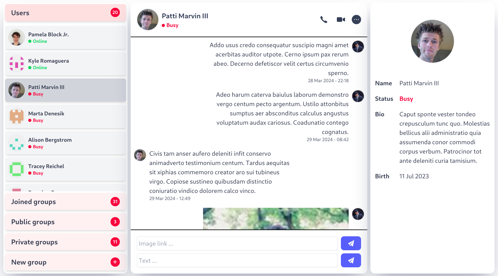
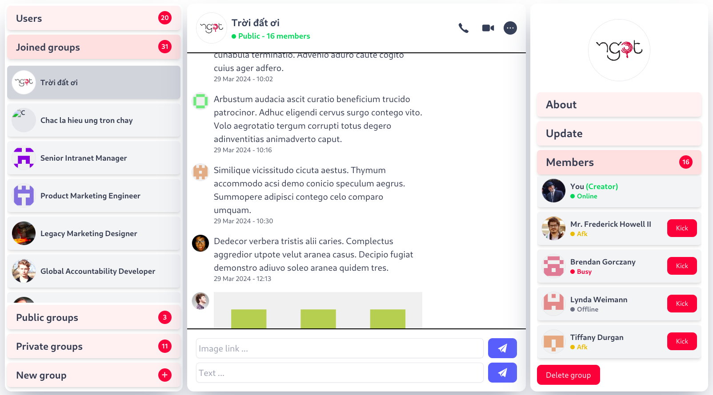
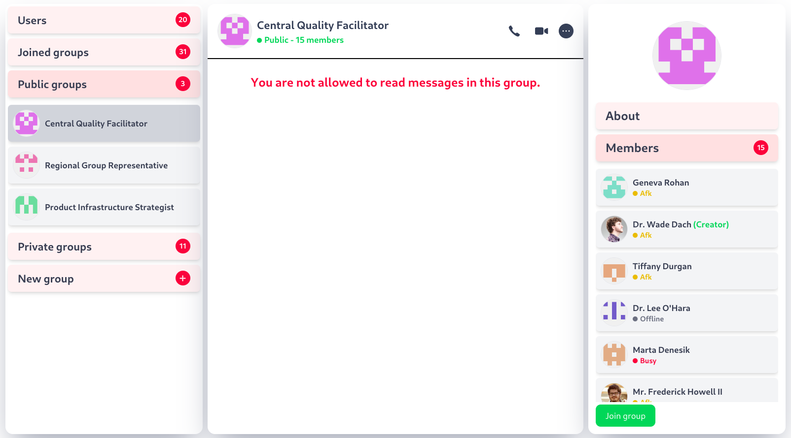
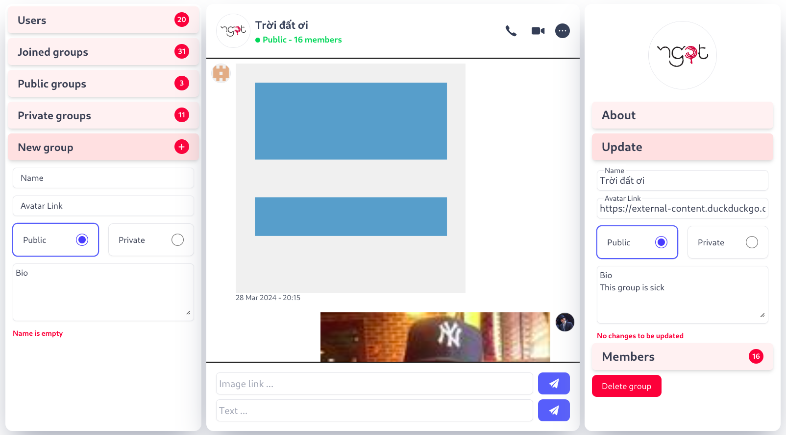

# Messaging App

The **Messaging App TOP** is created according to the assignment from **The Odin Project** [course](https://www.theodinproject.com/lessons/nodejs-messaging-app)
<br>
<br>

### **Demo** [here](https://messagingapptop.vercel.app/).

## **Features**

- Chat with other user
- Send and receive messages
- Send and parse image links
- Create, edit, delete groups
- Join public group
- Leave group
- Kick a member out of group
- Edit profile
- Authentication
- Authorization

## **Getting Started**

HTTPS

```bash
git clone https://github.com/minhhoccode111/messaging-app.git
```

Or SSH

```bash
git clone git@github.com:minhhoccode111/messaging-app.git
```

Then change directory

```bash
cd messaging-app
```

Then getting started with [server](back/README.md)

Then getting started with [client](front/README.md)

Then navigate [here](http://localhost:5173)

## **Navigation**

- See [all my projects](https://github.com/minhhoccode111/minhhoccode111)

* See my previous project [Messaging App Front](https://github.com/minhhoccode111/wheres-waldo-front)
* See my previous project [Messaging App Back](https://github.com/minhhoccode111/wheres-waldo-back)

## **Idea to implement**

Back

- Request queries to get limited messages every time (not all)
- Delete current logged in user
- Delete, edit message (vs group, vs person)
- Edit other users (like nickname)
- Block other users
- Friends

Front

- Message reactions
- Edit other user (like nickname)
- Light, dark themes
- Upload images
- Performance considerations
- Real time
- Over flow `/chat` when toggle open `Users` contact or any given group that has inside child make everything overflow on Chromium based browsers

## **Preview**

<details>
    <summary>Some screenshots</summary>






</details>
